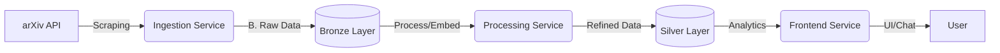

# arXiv 🚀

> **Arquitetura de Microserviços baseada no padrão Medalhão (Bronze/Silver) para engenharia de dados, CI/CD e Cloud AWS.**

Explore a implementação prática de uma plataforma moderna de dados, demonstrando domínio em **Engenharia de Software**, **DevOps** e **Data Engineering**. O projeto evolui desde a ingestão bruta até a visualização analítica, utilizando as tecnologias mais robustas do mercado.

---

## 🏗️ Arquitetura do Projeto

O sistema é composto por serviços independentes (**Microserviços**) que se comunicam de forma desacoplada.



---

## 🧭 Roteiro de Implementação (Phases)

O desenvolvimento foi estrategicamente dividido em fases para garantir qualidade e entrega contínua.

### ✅ **Fase 1: Ingestion Service**
*   **Objetivo:** Coletar dados brutos do arXiv e persistir na camada Bronze.
*   **Stack:** Python 3.12, FastAPI, BeautifulSoup, Docker.
*   **Destaques:** 
    *   Testes Unitários e de Integração (100% Coverage).
    *   Arquitetura limpa com Inversão de Dependência (planejado).
    *   Dockerização completa.

### 🚧 **Fase 2: Processing Service**
*   **Objetivo:** Limpeza, normalização e enriquecimento dos dados (Embeddings).
*   **Stack:** DuckDB, Pandas, OpenAI/HuggingFace.
*   **Entrega:** Dados estruturados na camada Silver/Gold.

### 📅 **Fase 3: Frontend Service**
*   **Objetivo:** Interface interativa para busca e chat com, os artigos.
*   **Stack:** Streamlit.

### ☁️ **Fase 4: Cloud & CI/CD**
*   **Objetivo:** Deploy escalável e automatizado.
*   **Stack:** AWS (ECS/EKS), GitHub Actions, Terraform.

---

## 🛠️ Tecnologias Utilizadas

| Categoria | Tecnologias |
| :--- | :--- |
| **Linguagem** |  |
| **Web Framework** |  |
| **Dados** |  |
| **Container** |  |
| **Qualidade** | `pytest`, `pre-commit`, `ruff`, `black`, `bump2version` |

---

## 🚀 Como Executar (Fase 1)

Para rodar o serviço de ingestão localmente ou via Docker, consulte o guia detalhado de implementação:

👉 **[Guia Completo de Implementação (Documentação)](documentacao.md)**

Em resumo:
```bash
# 1. Clone o repositório
git clone https://github.com/Prof-Saulo-Santos/webscraping_medalhao_microservicos_CICD_AWS.git

# 2. Suba o Ingestion Service via Docker
cd ingestion_service
docker build -t ingestion-service:v1 .
docker run -p 8000:8000 -v "$(pwd)/data:/service/data" ingestion-service:v1

# 3. Teste a ingestão
curl -X POST http://localhost:8000/ingest
```

---

## 👨‍💻 Autor

Desenvolvido como parte prática de um portfolio de alta performance.

**Prof. Saulo Santos** - *Microservices & Data Engineering*
